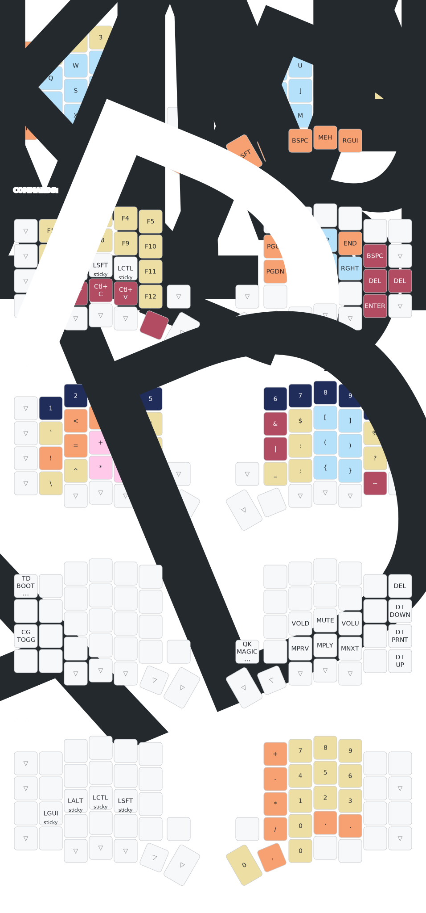

QMK keymaps for my programmable keyboards.

So far, just one: a Sofle.

## Sofle layout

## ToDos

- [ ] combo directory management - https://docs.qmk.fm/features/combo#dictionary-management 

## Interesting links for future reference

- https://github.com/qmk/awesome-userspaces/
- https://github.com/qmk/qmk_userspace/forks
- https://github.com/qmk/qmk_firmware/blob/master/keyboards/crkbd/crkbd.c 
